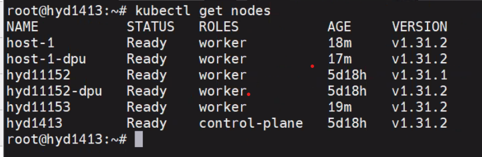
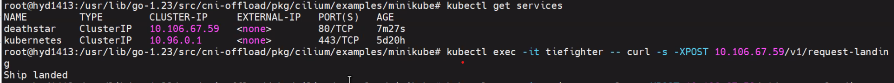

..  SPDX-License-Identifier: Marvell-MIT
    Copyright (c) 2025 Marvell.

# Kubernetes CNI Offload

## Introduction

Kubernetes networking is handled outside of Kubernetes core, this is based on standardized framework called Container network interface (CNI). There are many CNIs available with varying adoption rates in the market. The most popular one is Cilium CNI, this is used very widely including even all the hyper-scalers. We have created a solution to offload it completely to Marvell DPU. The solution is architected in a way such that it can be adopted to offload other CNIs to the DPU. It is done without changing Kubernetes and created a working PoC with Cilium as the offloaded CNI.

- **Overview**: Kubernetes has become the de-facto control plane for cloud-native workloads, orchestrating everything from stateless micro-services to state-heavy AI clusters. One of the reasons it scales so well is that core Kubernetes stays blissfully unaware of the packet paths between Pods. Instead, the kubelet simply invokes a Container Network Interface (CNI)plug-in every time a Pod is created or destroyed and lets that plug-in wire the Pod into the node’s network stack.

- **Container Network Interface**: The CNI specification is intentionally tiny—four JSON verbs (ADD, DEL, CHECK, VERSION) that a binary must implement. When the kubelet launches a Pod it passes the Pod’s namespace, network‐namespace FD, and a blob of configuration to the plug-in; the plug-in returns an IP, routes, and optional metadata. Because Kubernetes never looks behind that curtain, any data-plane technology—iptables, eBPF, OVS, SR-IOV, hardware offload—can be dropped in as long as it speaks the CNI API.

- **Cilium CNI**: Dozens of CNIs have appeared since the spec first landed, of the lot Cilium and Calico dominate the usage space. Cilium’s eBPF data path, deep observability, and production burn-in at every major hyperscaler have made it the default choice in many clusters.

- **Primary CNI Offload**: Even with eBPF, every packet still burns host CPU cycles, cache lines, and memory bandwidth. In a node running GPU-heavy or IO-hungry applications those cycles are better spent on the workload itself. A DPU (Data Processing Unit) adds an isolated NIC-attached SoC that can run Linux, off-load switching, crypto, and telemetry—without stealing host resources. Existing off-load projects usually bolt a secondary network onto the DPU, forcing the second network programming to be handled separately.

- **Solution**: This repository demonstrates how the entire Cilium data path—from Pod veth creation to L7 policy enforcement—can live on a Marvell OCTEON DPU while the kubelet and Pods run unmodified on the host. No patches to Kubernetes, CRI, or the node OS. The kubelet still calls cniAdd, but the heavy lifting happens on the DPU.Minimal CNI delta: Only a thin “shim” around the stock Cilium binary redirects eBPF program loads and policy updates to the DPU. Upstream rebases are trivial. The off-load agent speaks gRPC between the host and DPU. This PoC is a first step toward making the DPU the default home for Kubernetes primary networking, freeing host CPUs for applications and paving the way for richer in-fabric visibility, off-loaded service meshes, and zero-trust enforcement at wire speed with Octeon’s crypto acceleration capabilities.

## Architecture of CNI-Offload Solution


### Host Components

- **cni-offload-host**: A host-side daemonset that performs initialization tasks on the host, such as placing offload-cni in `/opt/cni/bin` and the configuration file in `/etc/cni/net.d/`, then goes to sleep.
- **offload-cni**: A CNI Plugin binary on the host, implements CNI commands such as Add and Del, handles container networking of pods running on the host and sends the events down to the DPU via gRPC API.
- **pcie_ep_octeon_host**: A host-side linux kernel drivers for running packet IO between host and an Octeon CN10k connected to that host in PCIe EP mode. It contains sources for octeon_ep.ko and octeon-ep_vf.ko drivers.

### DPU Components

- **cni-offload-agent**: A daemonset running on each DPU which contains a gRPC Server to listen to host-side calls for each pod creation on the host.
- **Offload-Cilium-CNI**: A CNI plugin binary on the DPU called from cni-offload-agent for add/del/check calls for the pod on the host coming via gRPC.
- **pcie_ep_octeon_target**: A control plane agent on DPU which facilitates packet I/O between any host and an Octeon CN10K connected to that host in PCIe EP mode. It contains octep_cp_agent application and octep_cp_lib library.

### Solution Software and Firmware Matrix
The below details capture the exact versions of every component that is used to build and verify this solution. Deploying with these versions guarantees you will hit same code paths that we have tested and documented.

- Cilium CNI:
  - repo: https://github.com/cilium/cilium.git
  - commit: c81fa2e447990c8834320b2c5401a4a759c76e55
  - version: 1.17.0-dev

- SR-IOV CNI plugin:
  - repo: https://github.com/k8snetworkplumbingwg/sriov-cni
  - commit: fca6591297c0e52b6522573bd367ccb7d6551fd0

- Octeon Endpoint Agent:
  - repo: https://github.com/MarvellEmbeddedProcessors/pcie_ep_octeon_target.git
  - commit: aa84a2331f76b68583e7b5861f17f5f3cef0fbd0
  - guide: https://marvellembeddedprocessors.github.io/dao/guides/howtoguides/octep_agent.html

- Octeon CN10KA Firmware
  - version: SDK 12.25.01
  - guide: https://marvellembeddedprocessors.github.io/dao/guides/gsg/firmware.html

- Linux kernel for DPU:
  - repo: https://github.com/MarvellEmbeddedProcessors/linux-marvell.git
  - branch: linux-6.1.x-release
  - commit: 177cbd9a96f8bb53b93afd8c2b044615cc73e6f3
  - version: 6.1.67
  - guide: https://marvellembeddedprocessors.github.io/dao/guides/gsg/kernel.html
  - additional kernel configuration for cilium(https://docs.cilium.io/en/stable/operations/system_requirements/)

- Host SDP kernel driver:
  - repo: https://github.com/MarvellEmbeddedProcessors/pcie_ep_octeon_host
  - branch: pcie_ep_octeon_host-release
  - commit: c1dd4d9d0026650032300a6de424aba9737cfaa1
  - guide: https://marvellembeddedprocessors.github.io/dao/guides/howtoguides/sdp_host.html

## Installation Steps

### System Requirements:
- Host details:
  - x86 server with CN106-PCIe card connected in PCIe-EP mode
  - os: Ubuntu 22.04 or later
  - linux kernel: 6.8.0-59-generic
  - architecture: x86_64

- DPU details:
  - Board Model:    crb106-pcie
  - Chip:  0xb9 Pass A1
  - Board Serial: WA-CN106-A1-PCIE-2P100-R1-027
  - linux kernel: 6.1.67
  - os: Ubuntu 20.04.4 LTS
  - architecture: aarch64

- Hugepage memory required: 256 Mb
- Hugepages supported: 32Mb, 512Mb, 1Gb
- Firewall exceptions for cilium(https://docs.cilium.io/en/stable/operations/system_requirements/#firewall-rules)
- Firewall exception for cni-offload-agent: port 8000/tcp
- Firewall exception for kubernetes API server: port 6443/tcp
- Firewall exception for kubelet API: port 10250/tcp
- systemd services required by cilium: systemd-resolvd

- System should satisfy the criteria for running a Kubernetes cluster.
- Software packages:
  - make,[go1.23 or later](https://go.dev/doc/install)
  - Same as Cilium.

### Add nodes to k8s Cluster

CNI-Offload Solution can be seamleslly  installed on a hybrid cluster where some node has DPU and some does not.
For nodes with DPUs, the primary network tasks are offloaded to the DPU, enhancing performance and efficiency. Meanwhile, nodes without DPUs continue to operate with the default Cilium configuration, running directly on the host

- Create a Kubernetes Cluster with a Master in the standard way (taint) using kubeadm.
- Create a docker registry locally or dockerhub where all docker images will be pushed

```bash
# Add DPU to cluster for offload solution:
  # ssh to host to get <hostname>
  1. cat /etc/hostname
  # On DPU
  # Steps to bring up DPU
  2. login to DPU through ssh ip
  # Set linux hostname of dpu to <hostname>-dpu
  3. vi /etc/hostname
  4. <hostname>-dpu
  5. Restart dpu to reflect new configuration of dpu
  # Add DPU as node to k8s cluster using kubeadm join command
  # join command is obtained from Master node by running ## kubeadm token create --print-join-command
  5. kubeadm join

# Add Host to cluster
  # Follow the standard method to join the node using kubeadm
   kubeadm join

# On Master
  # Add labels to the host connected with DPU for offload solution
  1. kubectl label node <hostname> cni.offload=<hostname>-dpu
  2. kubectl label node <hostname> marvell.com/dpu=true
  3. kubectl taint node <hostname> node.cilium.io/agent-not-ready- (After make deploy)

```

### Build and Deploy CNI-Offload Solution

```bash
# Clone code on master node and any one of arm server/dpu(cn106)
1. git clone https://github.com/MarvellEmbeddedProcessors/k8s-cni-offload.git
2. cd k8s-cni-offload
# Ensure to run a docker repository where docker Images will be pushed
3. Set REPOSITORY := <name of registry > in following files
   a. Makefile
   b. deployments/cni-offload-agent.yaml
   c. deployments/cni-offload-host.yaml

# Configure serverPort in cmd/dpu/cniOffloadAgent/cni-offload-config.yaml
      # default: 8000

# Build the Solution on Master Node (needs docker buildx builder with amd64/arm64)
4. make build
# Deploy the Solution into Cluster from Master Node
5. make deploy
```

### Verify CNI-Offload Solution is Deployed

```kubectl get pod -Ao wide ```


No cilium-agent pod will be scheduled on the host equipped with a DPU. Both the cilium-agent and the cilium-cni binary are fully offloaded to the DPU, as illustrated in the diagram.

The cni-offload-agent installs a systemd service responsible for setting up the octep-cp-agent. It also launches the cniOffloadAgent as a process.

```bash
  # On Master node, check if below pods are running:
  kubectl get pods -n kube-system
  NAMESPACE     NAME                               READY   STATUS  NODE
  kube-system   cni-offload-agent-qzkmb            1/1     Running worker2-dpu
  kube-system   cni-offload-host-txkxk             1/1     Running worker2
  kube-system   cilium-5cx5k                       1/1     Running worker2-dpu

  # ssh into DPU to check below services are running:
  # Verify setup-dpu systemd service is running
  systemctl status setup-dpu

  # Verify octep_cp_agent process is running
  ps -aef | grep octep_cp_agent
  root         889       1  0 17:31 ?        00:00:00 ./octep_cp_agent cn106xx.cfg

  #  Note: in case of octep_cp_agent not running, please check journalctl logs using:
  #  journalctl -u setup-dpu
  #  further reference: https://github.com/MarvellEmbeddedProcessors/pcie_ep_octeon_host

  # Verify cniOffloadAgent is running
  ps -aef | grep cniOffloadAgent

  # ssh into Host to check below files are present:
  ls /etc/cni/net.d/20-offload-cni.conf
  ls /opt/cni/bin/offload-cni

  # Configure host connected with DPU over PCIe EP mode for offload solution:
  # After DPU's cp agent comes up, load PF driver
  # Load upstream drivers
  1. modprobe octeon_ep
  # If upstream driver is not available, refer to below sources:
  https://github.com/MarvellEmbeddedProcessors/pcie_ep_octeon_host
  1. insmod octeon_ep.ko
  # Check dmesg log  "Firmware ready status = 1"
  2. dmesg
  # Verify interface pci address
  3. lspci | grep Cavium
  # Verify interface Name:
  4. ls /sys/bus/pci/devices/<PCIADDRESS>/net/
  # Assign interface IP Address
  5. nmcli dev mod <InterfaceName> ipv4.method manual ipv4.addr "192.168.1.2/24"
  # Verify ping
  6. ping 192.168.1.1
  # Load VF driver
  7. modprobe octeon_ep_vf
  # If upstream driver is not available, follow below step
  7. insmod octeon_ep_vf.ko
  # Create SR-IOV VF's
  8. echo 8 > /sys/bus/pci/devices/<PCIADDRESS>/sriov_numvfs
  # Verify VF's are created
  9. lspci | grep Cavium
  # Note: in case of SDP Interfaces are not coming Up or driver load is failing refer to firmware driver guide https://github.com/MarvellEmbeddedProcessors/pcie_ep_octeon_host


  # Scheduling a pod on host should be successful:
  kubectl get pods -o wide
  NAME                                        READY   STATUS    RESTARTS   AGE   IP          NODE 
  iperf3-deployment-server-665886b779-glxrz   1/1     Running   0          15h   10.0.3.41   worker2

  # cni-offload-agent logs:
  kubectl logs -n kube-system   cni-offload-agent-964qd

  2025-05-25T15:30:26.276101961Z [info] offloadCiliumCni: The Add response is:%!(EXTRA types100.Result={0.3.1 [{Name:enP2p1s0v2 Mac:be:52:5b:7d:af:89 Mtu:0 Sandbox:/proc/2258/task/3022/ns/net SocketPath: PciID:}] [{Interface:0x4000843fa8 Address:{IP:10.0.3.41 Mask:ffffffff} Gateway:10.0.3.208}] [{Dst:{IP:10.0.3.208 Mask:ffffffff}

  # To debug offload-cni, ssh into host and check offload-cni logs:
  vi /tmp/offload-cni.log
```

## Test Star Wars Demo with CNI-Offload
To test services and policies for the offloaded solution, we used the standard Cilium approach with the Star Wars example, available at:
``` cilium/examples/minikube/ ```


### Testbed Diagram:


```bash
# Pods shown in the diagram
Test pod 1 - Xwing (XW)
Test pod 2 - Tiefighter (TF)
Service pods - Deathstar (DS)
Cilium Agent pod CA
```

```bash
# Nodes shown in the diagram
master node - hyd1413
worker 1 - host-1
worker 2 - hyd11152
worker 3 - hyd11153
```

```kubectl get node ```



### Deploy Services
``` kubectl apply -f build/cilium/examples/minikube/http-sw-app.yaml ```

we have clusterIP services running in the name of deathstar which abstract both deathstar pods

``` kubectl get svc  ```


### Service Offload Validation

ClusterIP can be used to send traffic to deathstar pod from either tiefighter or xwing



### Policy Offload Validation

```
cd build/cilium/examples/minikube/
kubectl apply -f sw_l3_l4_l7_policy.yaml   sw_l3_l4_policy.yaml
```

After applying policies yaml file one can restrict entry to deathstar pod from either of xwing or tiefighter in this case
we are restricting any traffic to deathstar pod from xwing as per l3-l4-l7 policies so all traffic from tiefighter will be able to land on deathstar ship but from xwing will be denied.


### Star Wars Demo Video with CNI-Offload

```bash
This demo showcases the following aspects of this PoC

1. setup information/topology
2. Deployment
3. Star Wars Demo
```

.. raw:: html
  :file: ../_static/demo/cni_offload.html

## Test IPsec Transparent Encryption with CNI-Offload

``` bash
# copy lib/firmware/ from rootfs from SDK
cp -r <rootfs>/lib/firmware <DPU>/lib/firmware/

# Create CPT VF for Look Aside IPSec
echo 1 > /sys/bus/pci/devices/0002\:20\:00.0/sriov_numvfs

# Deploy Cilium with IPSec
1. make deploy-ipsec

# Check encryption status
2. kubectl exec -it -n kube-system <cilium-agent pod> -- cilium encrypt status

# Start tcpdump in dpu
3. ssh root@<dpu-ip> tcpdump -i eth0

# Create starwars demo
4. kubectl apply -f build/cilium/examples/minikube/http-sw-app.yaml

# Post http request to create traffic
5. kubectl exec xwing -- curl -s -XPOST deathstar.default.svc.cluster.local/v1/request-landing

# Check tcpdump for ESP packet
16:10:30.388280 IP (tos 0x0, ttl 64, id 50931, offset 0, flags [none], proto UDP (17), length 1498)
    10.29.45.6.58060 > 10.29.45.83.8472: [no cksum] OTV, flags [I] (0x08), overlay 0, instance 29048
IP (tos 0x0, ttl 64, id 5, offset 0, flags [DF], proto ESP (50), length 1448)
    10.0.3.208 > 10.0.4.145: ESP(spi=0x00000006,seq=0x2e83614), length 1428

# Check CPT instruction counter for number of packets processed
6. cat /sys/kernel/debug/cn10k/cpt/cpt_pc

CPT instruction requests   100700
# (number of packets processed - 100700)
```

### IPSec Demo Video with CNI-Offload

```bash
This demo showcases the following aspects of this PoC

1. Cilium Deployment with IPSec Encryption
2. Pod traffic encryption is handled in DPU
```

.. raw:: html
  :file: ../_static/demo/cni_offload_ipsec.html
